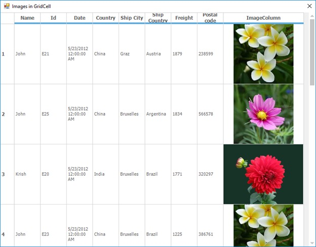

# How to Load the Image without Reducing the Resolution in WinForm GridControl?

This example demonstrates that how to load the image without reducing the resolution in [WinForms GridControl](https://www.syncfusion.com/winforms-ui-controls/grid-control).

To maintain the image resolution, convert the image as byte format and use Byte datatype for the image column in the grid. By default, when the image loaded in the grid cell is resized using the [ImageSize](https://learn.microsoft.com/pt-br/dotnet/api/system.windows.forms.imagelist.imagesize?redirectedfrom=MSDN&view=netframework-4.7.2) property, the resolution of the image gets affected.

``` csharp
private DataTable CreateTable()
{
    dt.Columns.Add("Name");
    dt.Columns.Add("Id");
    dt.Columns.Add("Date");
    dt.Columns.Add("Country");
    dt.Columns.Add("Ship City");
    dt.Columns.Add("Ship Country");
    dt.Columns.Add("Freight");
    dt.Columns.Add("Postal code");
    dt.Columns.Add("ImageColumn", typeof(byte[]));
 
    for (int l = 0; l <= gridControl1.RowCount; l++)
    {
        DataRow dr = dt.NewRow();
        dr[0] = name1[r.Next(0, 5)];
        dr[1] = "E" + r.Next(30);
        dr[2] = new DateTime(2012, 5, 23);
        dr[3] = country[r.Next(0, 5)];
        dr[4] = city[r.Next(0, 5)];
        dr[5] = scountry[r.Next(0, 5)];
        dr[6] = r.Next(1000, 2000);
        dr[7] = r.Next(10 + (r.Next(600000, 600100)));
        //Adding image as Byte[] array.
        Byte[] imageArray = System.IO.File.ReadAllBytes(FindFile(@"flower" + l % 3 + ".jpg"));
        dr[8] = imageArray;
        dt.Rows.Add(dr);
    }
    return dt;
}
```

The screenshot below illustrates the images without reducing the resolution.


